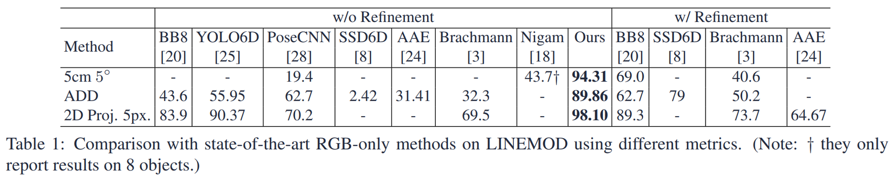

## News:
- Our CDPN wins "The Best RGB-Only Method Awards" on the BOP Challenge on ICCV2019 (code link: https://github.com/LZGMatrix/BOP19_CDPN_2019ICCV).
- Our CDPNv2 wins the "The Best Methods on Individual Datasets" on the BOP Challenge on ECCV2020 (code link: https://github.com/LZGMatrix/BOP19_CDPN_2019ICCV/tree/bop2020).

# CDPN: Coordinates-based Disentangled Pose Network for Real-time RGB-based 6-DoF Object Pose Estimation
6-DoF object pose estimation from a single RGB image is a fundamental and long-standing problem in computer vision. Current leading approaches solve it by training deep networks to either regress both rotation and translation from image directly or to construct 2D-3D correspondences and further solve them via PnP indirectly. We argue that rotation and translation should be treated differently for their significant difference. In this work, we propose a novel 6-DoF pose estimation approach: Coordinates-based Disentangled Pose Network (CDPN), which disentangles the pose to predict rotation and translation separately to achieve highly accurate and robust pose estimation. Our method is flexible, efficient, highly accurate and can deal with texture-less and occluded objects. Extensive experiments on LINEMOD and Occlusion datasets are conducted and demonstrate the superiority of our approach. Concretely, our approach significantly exceeds the state-of-theart RGB-based methods on commonly used metrics.


> [CDPN: Coordinates-based Disentangled Pose Network for Real-time RGB-based 6-DoF Object Pose Estimation](https://openaccess.thecvf.com/content_ICCV_2019/papers/Li_CDPN_Coordinates-Based_Disentangled_Pose_Network_for_Real-Time_RGB-Based_6-DoF_Object_ICCV_2019_paper.pdf)  
> Zhigang Li, Gu Wang, Xiangyang Ji   
> ICCV 2019 (Oral) 
> [paper](https://openaccess.thecvf.com/content_ICCV_2019/papers/Li_CDPN_Coordinates-Based_Disentangled_Pose_Network_for_Real-Time_RGB-Based_6-DoF_Object_ICCV_2019_paper.pdf), [supplement](https://openaccess.thecvf.com/content_ICCV_2019/supplemental/Li_CDPN_Coordinates-Based_Disentangled_ICCV_2019_supplemental.pdf), [oral](https://www.youtube.com/watch?v=zem03fZWLrQ)

We provide the clean-version training code of our ICCV 2019 paper ["CDPN: Coordinates-based Disentangled Pose Network for Real-time RGB-based 6-DoF Object Pose Estimation"](https://openaccess.thecvf.com/content_ICCV_2019/papers/Li_CDPN_Coordinates-Based_Disentangled_Pose_Network_for_Real-Time_RGB-Based_6-DoF_Object_ICCV_2019_paper.pdf). This code can perfectly reproduce the impressive results of our paper. 

If you find this code useful for your research, please cite our paper:

```
@InProceedings{Li_2019_ICCV,
author = {Li, Zhigang and Wang, Gu and Ji, Xiangyang},
title = {CDPN: Coordinates-Based Disentangled Pose Network for Real-Time RGB-Based 6-DoF Object Pose Estimation},
booktitle = {Proceedings of the IEEE/CVF International Conference on Computer Vision (ICCV)},
month = {October},
year = {2019}
}
```

## Environment

Set up python 3.6.7 environment：

```
pytorch==1.4.0
torchvision==0.5.0
numpy==1.19.3
opencv==4.5.0
tensorboardx==2.1

Other dependencies: 
yaml, pickle, pyparsing, progress, plyfile, scipy, tqdm, glob, os, sys...
```


## Prepare the dataset

1. Download training and test data of LINEMOD dataset:
   - The OpenGL training data can be found [here](https://pan.baidu.com/s/1QFGI4QQK5EEsnPSu2rk-aA) (password: b7kt).
   - The real training  data can be found [here](https://pan.baidu.com/s/1WCM5VU6n5_OhMUNhHq5CCw) (password: sesw).
   - The test data can be found [here](https://pan.baidu.com/s/18wn7wMRFQLWM2hkNillaCg) (password: mhko).
   - The 3D object models can be found [here](https://pan.baidu.com/s/1DyeUPUw_ePisDUij-4LC_Q) (password: ba4f).
2. Download VOC2012 dataset from official website (http://host.robots.ox.ac.uk/pascal/VOC/index.html).

   Note: The VOC2012 is only used as background data, which can also be replaced with other real-world datasets such as MS COCO dataset, SUN datset, and so on.

3. Prepare the dataset as follows:

```
Root
├── dataset
│   ├── bg_images
│   │   └── VOC2012
│   └── lm
│       ├── models
│       │   ├── ape
│       │   └── ...
│       ├── imgn
│       │   ├── ape
│       │   └── ...
│       ├── real_test
│       │   ├── ape
│       │   └── ...
│       └── real_train
│           ├── ape
│           └── ...
├── asserts
├── tools
├── lib
├── dataset_cache (automatically built in the first running)
└── exp (automatically built in running)
```


## Training

### 1. Stage 1:

- cd tools; and run:

```
sh train_stage1.sh
```
### 2. Stage 2:

- Edit the config file of stage 2 in path ./tools/exps_cfg/config_trans.yaml:

  > ​	Replace the 'path to the trained model of step1' with your actual path.

-	cd tools; and run:
```
sh train_stage2.sh
```
### 3. Stage 3:

- Edit the config file of stage 3 in path ./tools/exps_cfg/config_rot_trans.yaml:

  > ​	Replace the 'path to the trained model of step2' with your actual path.

- cd tools; and run:

```
sh train_stage3.sh
```
## Testing

For testing various models trained in stage1, stage2 and stage3:

1. Edit the config file by: 
   - Setting the "test" from False to True.
   - Setting the "load_model" with path of the testing model.
2. cd tools; and run:


```
python main.py --cfg=exps_cfg/path_to_your_config_file.yaml
```

## Results in our paper


## Our trained models
Our trained model ([download link](https://pan.baidu.com/s/1GPGjpYb9Xe-mICovElnD9Q),  password: 92e2) and log file ([download link](https://pan.baidu.com/s/1N2_HyWhm7Y1m9cutBFziVQ), password: n792) of stage 1:

| Object/Metric | 5^\circ \ 5cm | ADD       | Proj.\ 2D |
| ------------- | ------------- | --------- | ---------- |
| ape           | 84.76         | 15.24     | 95.9       |
| benchvise     | 97.38         | 94.86     | 95.44      |
| camera        | 98.04         | 71.76     | 98.53      |
| can           | 98.33         | 87.6      | 97.54      |
| cat           | 94.71         | 54.89     | 98.7       |
| driller       | 96.83         | 91.97     | 94.55      |
| duck          | 90.33         | 25.54     | 97.93      |
| eggbox        | 96.62         | 99.25     | 98.69      |
| glue          | 80.31         | 90.35     | 97.59      |
| holepuncher   | 98            | 74.6      | 99.81      |
| iron          | 94.99         | 94.08     | 95.71      |
| lamp          | 97.22         | 96.83     | 92.9       |
| phone         | 91.12         | 83.76     | 98.3       |
| **Average**   | **93.74**     | **75.44** | **97.05**  |

Our trained model ([download link](https://pan.baidu.com/s/1GxeWpAHzLMcA3I9I-fb7cg), password: q8rq) and log file ([download](https://pan.baidu.com/s/17OSrkPT7uIWYyfhaVR59iA), password: mdle) of stage 2:

|Object/Metric| 2cm       | 5cm       |
| ----------- | --------- | --------- |
| ape         | 89.71     | 99.14     |
| benchvise   | 92.82     | 99.9      |
| camera      | 95.1      | 99.9      |
| can         | 94.78     | 99.8      |
| cat         | 93.11     | 99.8      |
| driller     | 83.55     | 99.31     |
| duck        | 91.08     | 99.72     |
| eggbox      | 95.02     | 99.62     |
| glue        | 82.24     | 99.42     |
| holepuncher | 94.01     | 99.71     |
| iron        | 89.48     | 99.49     |
| lamp        | 89.83     | 99.71     |
| phone       | 83.66     | 98.87     |
| **Average** | **90.34** | **99.57** |

Our trained model ([download](https://pan.baidu.com/s/1tF76bOpzpTBl5tdUGVpbBg),  password: ksoo) and log file ([download](https://pan.baidu.com/s/1DjF_uCMv7oUpS4nPAjHFTQ), password: tb1q) of stage 3:

| Object/Metric | 5^\circ \ 5cm | ADD     | Proj.\ 2D |
| ------------- | --------------- | --------- | ---------- |
| ape           | 86.67           | 67.33     | 97.52      |
| benchvise     | 98.35           | 98.74     | 98.74      |
| camera        | 98.73           | 92.84     | 98.63      |
| can           | 98.92           | 96.56     | 99.61      |
| cat           | 95.61           | 86.63     | 99.30      |
| driller       | 96.93           | 95.14     | 94.85      |
| duck          | 92.30           | 75.21     | 98.40      |
| eggbox        | 97.84           | 99.62     | 99.06      |
| glue          | 82.24           | 99.61     | 98.36      |
| holepuncher   | 98.48           | 89.72     | 99.52      |
| iron          | 95.71           | 97.85     | 97.85      |
| lamp          | 97.79           | 97.79     | 95.68      |
| phone         | 92.16           | 90.65     | 96.79      |
| **Average**   | **94.75**       | **91.36** | **98.02**  |

## Acknowledgement

This work is affliated with Tsinghua University Xiangyang Ji's Lab. For business cooperation, welcome to contact: lzg15@mails.tsinghua.edu.cn & xyji@tsinghua.edu.cn.

```
Copyright (c) Tsinghua University Xiangyang Ji's Lab. All Rights Reserved.

Licensed under the Apache License, Version 2.0 (the "License");
you may not use this file except in compliance with the License.
You may obtain a copy of the License at

    http://www.apache.org/licenses/LICENSE-2.0

Unless required by applicable law or agreed to in writing, software
distributed under the License is distributed on an "AS IS" BASIS,
WITHOUT WARRANTIES OR CONDITIONS OF ANY KIND, either express or implied.
See the License for the specific language governing permissions and
limitations under the License.
```
